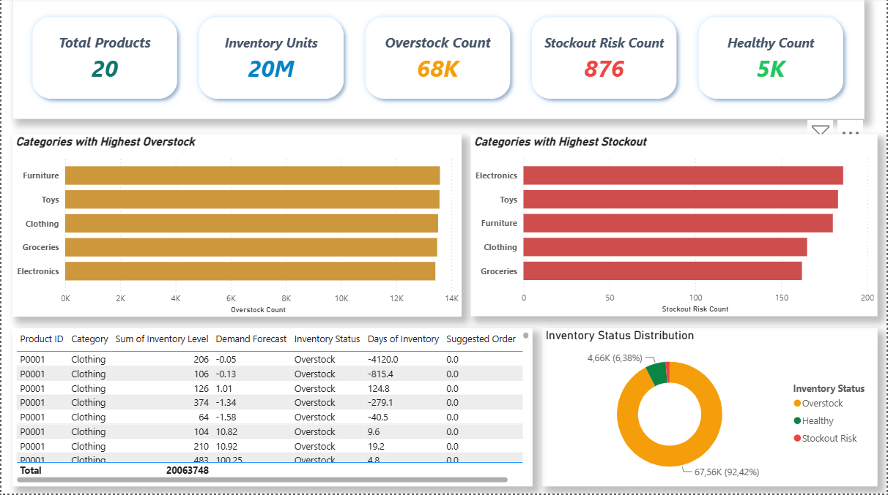
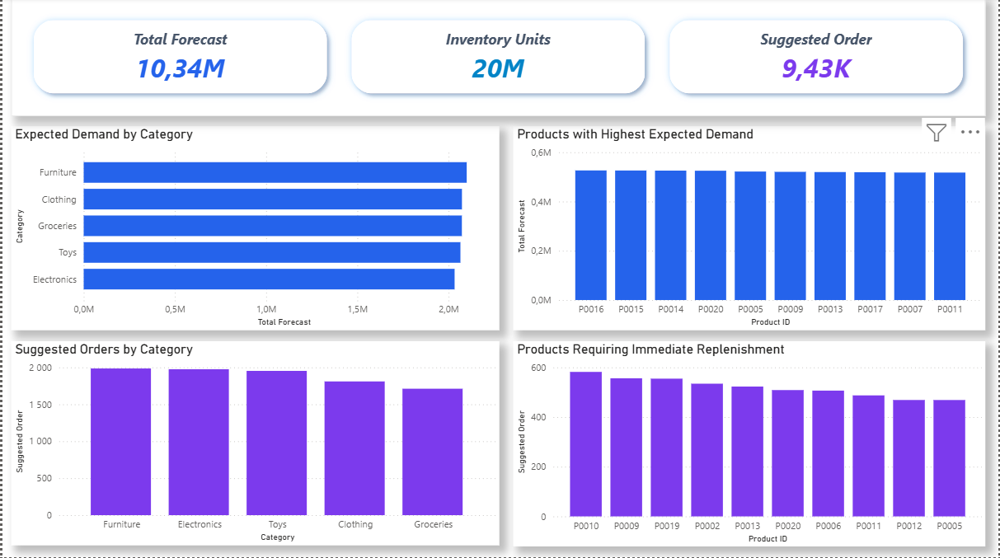

# 📦 End-to-End Demand Forecasting & Inventory Optimization System

An end-to-end data science project that forecasts product demand and transforms predictions into inventory recommendations to reduce overstock and stockout risks.

## 📌 Business Problem

Retail businesses constantly struggle with inventory imbalance.

Maintaining too much inventory increases storage costs and ties up capital, while insufficient inventory leads to stockouts, lost sales, and poor customer satisfaction.

Traditional inventory planning often relies on historical averages or manual decisions, making it difficult to react to changing demand patterns.

This project demonstrates how machine learning can forecast future product demand and convert those predictions into actionable inventory recommendations through business analytics and interactive Power Bi dashboards.

## 🎯 Project Objectives

The project aims to:

- Forecast future daily product demand using Machine Learning.
- Detect products at risk of stockout.
- Identify products with excess inventory.
- Generate inventory recommendations based on predicted demand.
- Provide an interactive Power BI dashboard for business decision-makers.

# 🏗 Project Architecture

- Business Problem

- Data Collection

- Data Cleaning

- Exploratory Data Analysis
 
- Feature Engineering

- TimeSeriesSplit Validation

- Demand Forecasting Model (ML)

- MLflow Experiment Tracking

- Inventory Analysis

- Power BI Dashboard

# 📂 Dataset

The dataset contains daily inventory and sales information for multiple products across different stores.

### Features include

- Date
- Store ID
- Product ID
- Category
- Region
- Inventory Level
- Units Sold
- Units Ordered
- Price
- Discount
- Competitor Pricing
- Holiday / Promotion
- Weather
- Seasonality

# 🧹 Data Preparation

Data preprocessing included:

- Missing value analysis
- Duplicate removal
- Data type conversion
- Date feature extraction
- Feature encoding

# 📊 Exploratory Data Analysis

EDA was performed to understand:

- Product demand patterns
- Sales distribution
- Inventory behavior
- Seasonal trends
- Category performance
- Feature relationships

# ⚙ Feature Engineering

Several business-oriented features were created, including:

- Month
- Day of Week
- Day of Month
- Lag Features:
    - Units Sold Lag 1
    - Units Sold Lag 7
- Rolling Averages
    - 7-day Average
    - 14-day Average
- Discount Amount
- Seasonality Encoding
- One-Hot Encoded Categories

# 🤖 Demand Forecasting Model

A supervised Machine Learning regression model was trained to predict future daily demand for each product.

### Validation Strategy

Unlike random train-test splitting, the project uses

- TimeSeriesSplit

to preserve chronological order and avoid data leakage.

# 📈 Experiment Tracking

Model experiments were tracked using **MLflow**.

Tracked information includes:

- Parameters
- Metrics
- Model Versions
- Best Performing Model

# 📦 Inventory Optimization

Predicted demand was transformed into business recommendations.

Additional inventory metrics were calculated.

### Inventory Gap

Inventory Gap = Inventory Level − Demand Forecast

### Days of Inventory

Days of Inventory = Inventory Level / Demand Forecast

### Inventory Status

Products were classified into:

- 🟢 Healthy
- 🟠 Overstock
- 🔴 Stockout Risk

### Suggested Order

Products identified as Stockout Risk receive a recommended replenishment quantity.

# 📊 Power BI Dashboard

The dashboard allows decision-makers to monitor inventory performance in real time.

## Page 1 — Inventory Health Dashboard

- Inventory KPIs
- Inventory Status Distribution
- Overstock by Category
- Stockout Risk by Category
- Product Recommendation Table

## Page 2 — Demand Forecast Insights

- Total Forecast
- Total Suggested Order
- Forecast by Category
- Suggested Orders by Category
- Top Products by Forecast
- Top Products Requiring Replenishment

# 🛠 Tech Stack

### Programming

- Python

### Data Analysis

- Pandas
- NumPy

### Visualization

- Matplotlib
- Seaborn

### Machine Learning

- Scikit-Learn
- XGBoost 

### Experiment Tracking

- MLflow

### Business Intelligence

- Power BI

# 📁 Project Structure

- Demand-Forecasting-Inventory-Optimization/│
- ├── data/
- ├── notebooks/
- ├── src/
- │   ├── data/
- │   ├── feature_engineering/
- │   ├── modeling/
- │   ├── inventory_analysis/
- ├── models/
- ├── dashboard/
- ├── mlruns/
- ├── requirements.txt
- └── README.md

# 📸 Dashboard Preview

### Inventory Health Dashboard

### Demand Forecast Dashboard

# 🚀 Key Outcomes

- Built an end-to-end demand forecasting pipeline.
- Predicted future daily product demand.
- Converted ML predictions into inventory decisions.
- Identified products at risk of overstock and stockout.
- Developed an interactive Power BI dashboard for inventory monitoring.
